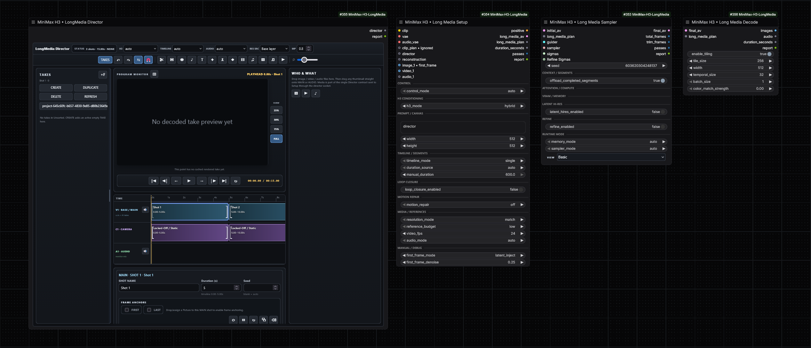

# ComfyUI-MiniMax-H3-LongMedia

Production-oriented ComfyUI nodes for **MiniMax H3** long-form video/audio generation, reference-driven editing, MultiClip planning, fixed segmentation, lip-sync and adaptive low-VRAM execution.



**Current stable release: 0.4.11**

## What 0.4.11 provides

- Unified clip executor for **MultiClip** and **fixed segmentation**.
- Per-clip prompt/duration/seed Planner for MultiClip.
- Fixed-duration long-form segmentation using the same continuation engine.
- Native Picture / Video / Audio reference conditioning.
- `video_ref_edit` for preserving source motion/camera/composition while transferring identity/style from Picture references.
- Source-audio preservation, reference and lip-sync policies.
- H3 Motion Context and AV handoff across clip boundaries.
- Geometry-aware low-VRAM governor and attention preflight.
- Embedded H3 Sol attention with streamed QKV / compressed K/V for long constrained sequences.
- Dynamic VRAM-aware model residency and memory cleanup.
- Tiled H3 video decode for long outputs.
- Native INT8 / W4A8 / supported quantized ComfyUI execution paths without replacing stock quantized math.

## Main nodes

The public workflow surface is intentionally compact:

- **MiniMax H3 • Long Media Setup**
- **MiniMax H3 • Long Media Planner**
- **MiniMax H3 • Long Media Sampler**
- **MiniMax H3 • Long Media Decode**

Internal helper nodes remain hidden from normal Add Node/search UI.

## Installation

Clone or copy the repository into:

```text
ComfyUI/custom_nodes/ComfyUI-MiniMax-H3-LongMedia
```

Restart ComfyUI after installation or update.

LongMedia's embedded Sol path does not require a separate `ComfyUI-sol-attn` installation.

## Workflow modes

### `hybrid_auto`

`image_1` is the opening-frame anchor. When connected, `image_2` can act as the final-frame anchor; remaining images are Picture references.

Use this when the opening image must strongly define the shot.

### `segmented_continuation`

Creates an automatic **fixed-duration timeline** from `segment_duration` and runs it through the same clip executor used by MultiClip.

Use this for a continuous long prompt when equal segment sizes are desirable or when segmenting primarily to control VRAM.

### `multiclip`

Uses the **Long Media Planner**. Every clip can have its own prompt, duration and optional seed.

Use this when the final movie has different actions, shots or durations per clip.

### `ref2va_full`

All connected images are normal `<Picture N>` references. No first/last image anchor is imposed.

### `video_ref_edit`

`video_1` is the main motion/camera/composition reference. `image_1..image_9` are Picture references used for identity/style replacement. If the source video soundtrack is needed, load/extract it separately and connect it to `audio_1`.

### `loop`

Reuses `image_1` as both first and last frame anchor for loop-oriented generation.

### `manual`

Exposes advanced conditioning/timeline controls for controlled diagnostics and A/B tests.

## MultiClip vs fixed segmentation

0.4.0 deliberately uses one continuation engine for both policies.

```text
LongMedia clip executor
├── fixed timeline    -> segmented_continuation
└── planned timeline  -> multiclip
```

The shared engine owns:

- global/local timeline conversion;
- per-clip conditioning;
- reference handling;
- Motion Context;
- audio slicing and lip-sync timing;
- AV handoff;
- sampling;
- stitching and final trim.

Only **clip-boundary math and prompt ownership** differ.

See:

- [`docs/PROMPTING_MULTICLIP.md`](docs/PROMPTING_MULTICLIP.md)
- [`docs/PROMPTING_SEGMENTATION.md`](docs/PROMPTING_SEGMENTATION.md)

## Planner ownership

The Planner is authoritative **only when**:

```text
workflow_mode = multiclip
```

If `clip_plan` remains connected while another workflow is selected, Setup ignores it. This prevents a connected Planner from silently overriding `workflow_mode`.

## Duration and segmentation

`segment_duration` is the amount of **new visible output timeline** generated per fixed segment. Continuation overlap is additional hidden context and does not subtract from this duration.

Example:

```text
final duration    = 30 s
segment_duration  = 8 s
```

LongMedia creates H3-aligned fixed clips internally and trims the final stitched result back to the requested duration.

## Audio modes

### `auto`
Default compatibility behavior.

### `preserve`
Restores source audio at output without intentionally using it as an H3 audio reference when possible.

### `generate`
Uses H3-generated output audio.

### `reference_only`
Uses input audio as H3 reference conditioning while retaining generated output audio.

### `preserve_reference`
Uses input audio as H3 reference/timing context and restores the untouched source track in the final result.

### `lip_sync`
Uses `audio_1` as the authoritative performance source for audiovisual timing and restores the untouched source track at output. There is no public manual reference-strength control in 0.4.0; lip-sync behavior is fixed by the mode rather than a user weight.

For performance prompts, describe the semantic action (`speaks`, `sings`) but let the source audio own phonetic timing.

## Reference inputs

- `image_1..image_9` → native H3 Picture references / workflow-specific image anchors.
- `video_1..video_3` → IMAGE frame batches used as native Video references.
- `audio_1..audio_3` → separately loaded AUDIO references.

A ComfyUI `IMAGE` connection does not carry a video soundtrack. When a loaded video has audio, connect the extracted audio separately.

## Resolution and reference budget

`resolution_mode=match` follows the requested/source geometry according to the active workflow. References are normalized to patch-safe geometry internally.

`reference_budget` controls how aggressively LongMedia limits reference payload. Large Picture/Video/Audio references increase packed sequence length and can dominate VRAM use.

For long or constrained runs, start with:

```text
reference_budget = low
```

then increase only if the additional reference fidelity is needed.

## Sampler: recommended production configuration

For normal production work:

```text
sampler_mode   = auto
memory_mode    = auto
attention_mode = auto
```

The runtime chooses an effective memory profile from the active H3 checkpoint, quantization/backend, GPU VRAM and packed sequence geometry.

See the full optimization guide:

- [`docs/SAMPLER_OPTIMIZATION.md`](docs/SAMPLER_OPTIMIZATION.md)

## Dynamic VRAM

Keep ComfyUI Dynamic VRAM enabled. Do **not** start ComfyUI with:

```text
--disable-dynamic-vram
```

LongMedia can run H3 checkpoints larger than physical VRAM by coordinating activation chunking with ComfyUI/AIMDO dynamic residency.

## OOM prevention

0.4.0 includes geometry-aware Governor V4 behavior. The runtime does not classify a huge sequence as safe solely because VRAM is free before transformer workspaces become resident.

For dangerous long sequences on constrained GPUs, LongMedia can reject a full-sequence Sage/existing attention path **before QKV allocation** and route into bounded streamed Sol attention.

The long-sequence path can use:

1. streamed QKV projection;
2. INT8 + scale K/V storage;
3. streamed Q processing;
4. chunked output projection;
5. chunked/fused transformer MLP execution where parity permits it;
6. streamed final H3 output projection;
7. inter-block and denoise-step VRAM guards.

Optimized paths retain stock/fallback behavior when numerical parity or runtime safety checks fail.

## Suggested segment sizes

These are starting points, not hard limits:

- **16 GB:** 7–10 s balanced; 5–8 s for difficult reference editing/lip-sync.
- **12 GB:** 5–8 s with low reference budget.
- **8 GB:** 4–6 s, low reference budget, expect transfer-bound execution.

A single 30 s pass can be technically possible with the streamed memory path, but fixed segmentation is usually preferable when quality, identity stability and throughput matter more than proving single-pass capacity.

## Prompting documentation

- [MultiClip prompting rules](docs/PROMPTING_MULTICLIP.md)
- [Fixed segmentation prompting rules](docs/PROMPTING_SEGMENTATION.md)
- [Sampler / VRAM / performance rules](docs/SAMPLER_OPTIMIZATION.md)
- [Architecture](docs/ARCHITECTURE.md)
- [0.4.0 release audit](docs/RELEASE_AUDIT.md)

## Example workflow

A public SAFE workflow is included at:

```text
workflows/MiniMax-H3-LongMedia-SAFE-1080p-15s.json
```

See [`workflows/README.md`](workflows/README.md) for dependencies and tuning notes.

The example may contain optional acceleration nodes from other packages. Those are not required by LongMedia itself.

## Compatibility

The project was previously named **ComfyUI-MiniMax-H3-LatentLab**. Internal ComfyUI class identifiers intentionally retain the legacy `MiniMaxH3LatentLab...` names so older workflows can continue to resolve their nodes.

The public display names use **MiniMax H3 LongMedia**.

## Third-party code

This repository contains an adapted subset of **Saganaki22/ComfyUI-sol-attn** under Apache License 2.0.

See:

- `THIRD_PARTY_NOTICE.md`
- `THIRD_PARTY_APACHE_2_0.txt`
- `sol_kernel/`

## Release quality

The stable 0.4.0 release promotes the validated pre-release baseline and removes pre-release-only hot-reload/runtime artifacts from the distributable package.

Release audit and verification details are documented in [`docs/RELEASE_AUDIT.md`](docs/RELEASE_AUDIT.md).

## License

See [`LICENSE`](LICENSE).
